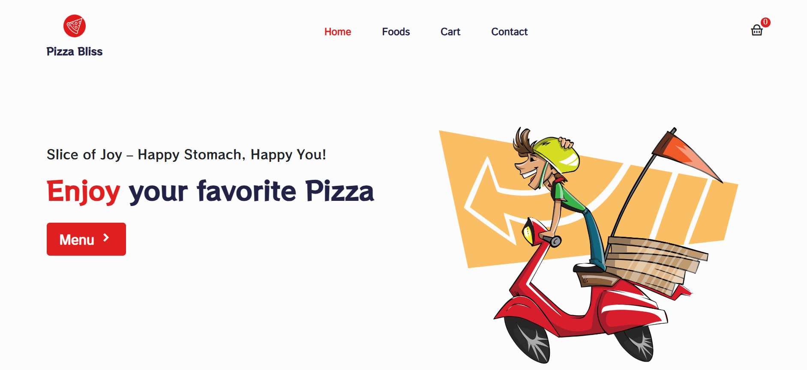
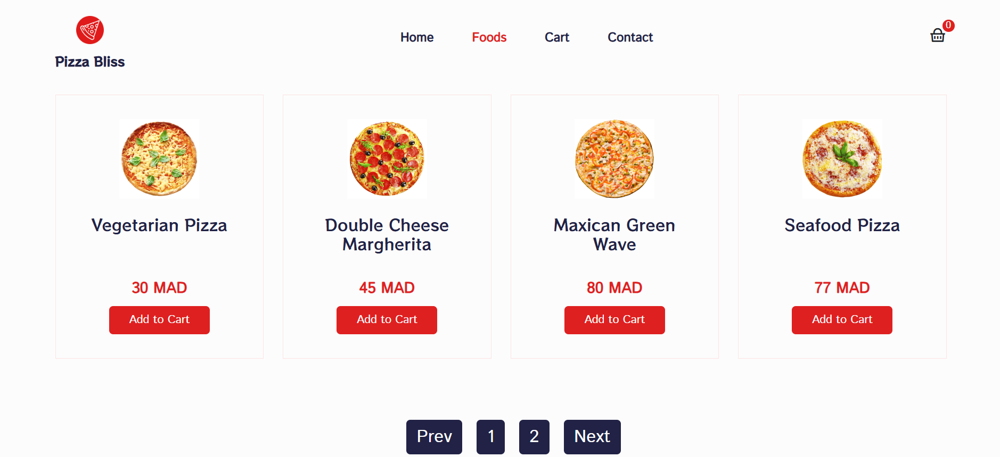
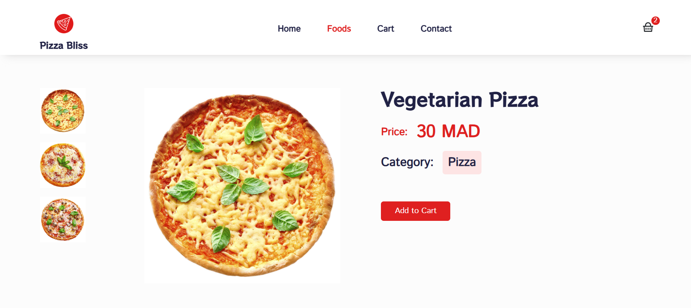
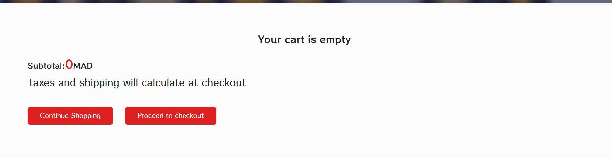
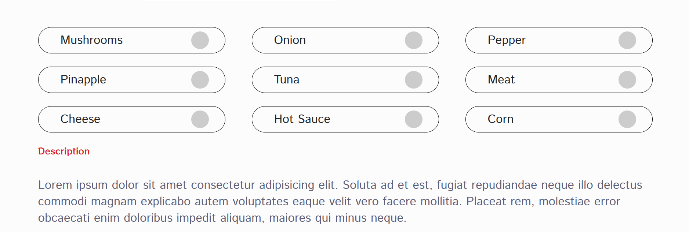
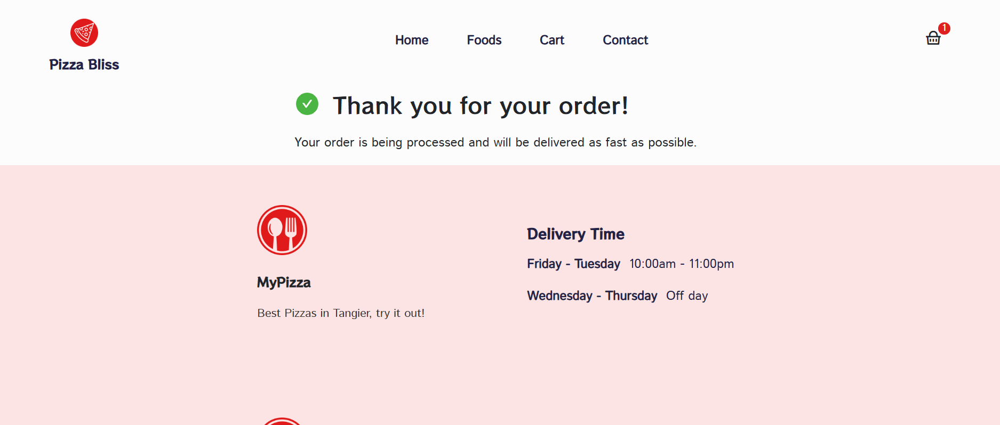

🍕✨🍕✨🍕✨🍕✨🍕✨🍕✨🍕✨🍕✨🍕✨🍕✨🍕✨🍕✨🍕✨🍕✨🍕✨🍕✨🍕✨🍕✨🍕✨🍕✨🍕✨🍕✨🍕✨🍕✨

Pizza Bliss – The Ultimate Pizza Ordering Experience 🍕✨
Overview:
Pizza Bliss is a sleek and user-friendly online pizza ordering platform designed for a smooth and enjoyable experience. With a simple and visually appealing interface, customers can easily customize and order their favorite pizzas in just a few clicks.

🍕✨🍕✨🍕✨🍕✨🍕✨🍕✨🍕✨🍕✨🍕✨🍕✨🍕✨🍕✨🍕✨🍕✨🍕✨🍕✨🍕✨🍕✨🍕✨🍕✨🍕✨🍕✨🍕✨🍕✨

Key Features & Interface Design
🔹 Home Page:

A welcoming, vibrant landing page with high-quality images of delicious pizzas.
A quick “menu” button to dive straight into home page to start ordering .
and  Choose extra add-ons (Extra cheese, Garlic dip, Spicy drizzle).

🔹 Order Summary & Checkout:

A clear, interactive cart that updates in real-time.

🍕✨🍕✨🍕✨🍕✨🍕✨🍕✨🍕✨🍕✨🍕✨🍕✨🍕✨🍕✨🍕✨🍕✨🍕✨🍕✨🍕✨🍕✨🍕✨🍕✨🍕✨🍕✨🍕✨🍕✨

Design Aesthetic:
🍕 Color Scheme: A warm palette of reds, yellows, and deep browns to reflect a fresh, baked feel.
📱 Responsive Design: Fully optimized for mobile and desktop for seamless ordering.
⚡ Fast & Smooth Navigation: Minimal clicks to complete an order for a hassle-free experience.

💻💻💻💻💻tools used💻💻💻💻💻 :
ReactJS – The core JavaScript library for building user interfaces.
react-dom – Provides DOM-specific methods that enable React to interact with the web page.
react-router-dom – A standard library for routing in React applications, allowing navigation between views.
Redux – A state management library for JavaScript applications, ensuring predictable state across the app.
react-redux – A binding library that helps React components interact with the Redux store.
@reduxjs/toolkit – An official set of utilities that simplifies working with Redux, offering tools like createSlice and configureStore.
redux-thunk – A middleware that allows action creators to return functions instead of plain objects for asynchronous operations.
redux-logger – A middleware for logging Redux state changes, useful for debugging and development.
CSS – The stylesheet language used to style your React components and overall app.

⚠️⚠️⚠️⚠️⚠️⚠️ to run the repo run the following comands in ur terminal: ⚠️⚠️⚠️⚠️⚠️⚠️
npm install 
$env:NODE_OPTIONS="--openssl-legacy-provider"
npm start

